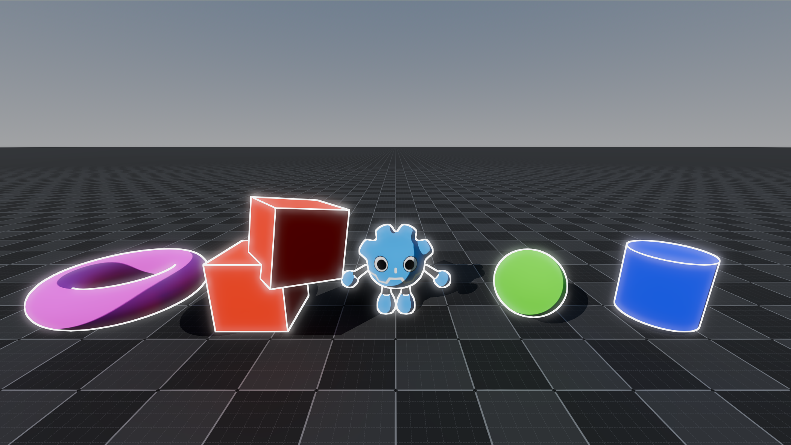

# Compositor Effect Playground
A Godot project for playing around with compositor effects.

## Effects

### Outlines

*Stencil → Extraction → Jump Flood → Outline*

#### References
| Link | Description |
|-|-|
| [Outline Shader - Roystan](https://roystan.net/articles/outline-shader/) | One of the articles that inspired me to implement this after reading years ago. |
| [Distance Field Outlines - Pink Arcana](https://github.com/pink-arcana/godot-distance-field-outlines) | First saw it when it came out in 2024. Great learning material. |
| [Getting started with CompositorEffects and Compute shaders - Pink Arcana](https://github.com/pink-arcana/godot-distance-field-outlines/discussions/1) | Discussion on the above. |

## Project References

| Link |
|-|
| [Scene Data Include](https://github.com/godotengine/godot/blob/master/servers/rendering/renderer_rd/shaders/scene_data_inc.glsl) |
| [Include Scene Data Virtually](https://github.com/godotengine/godot/blob/98782b6c8c9cabe0fb7c80bc62640735ecb076d3/servers/rendering/renderer_rd/renderer_scene_render_rd.cpp#L1679C6-L1679C7) |
| [Compute Shader Textures](https://nekotoarts.github.io/blog/Compute-Shader-Textures) |
| [Stencil Buffer Texture](https://github.com/dmlary/godot-demo-sencil-buffer-compositor-effect) |