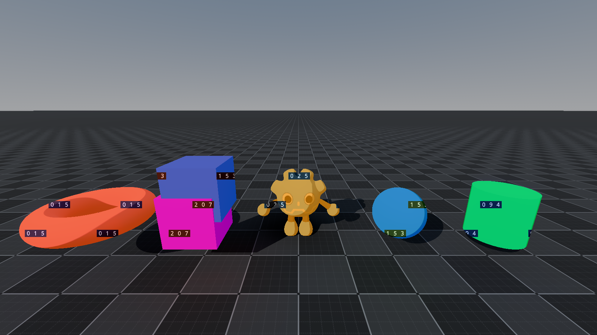
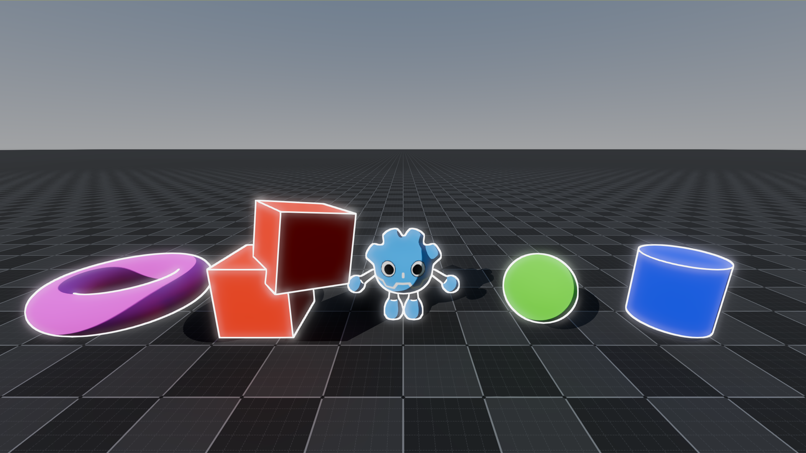
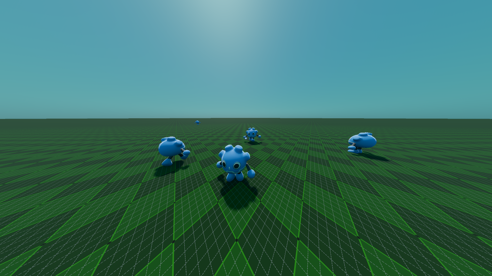
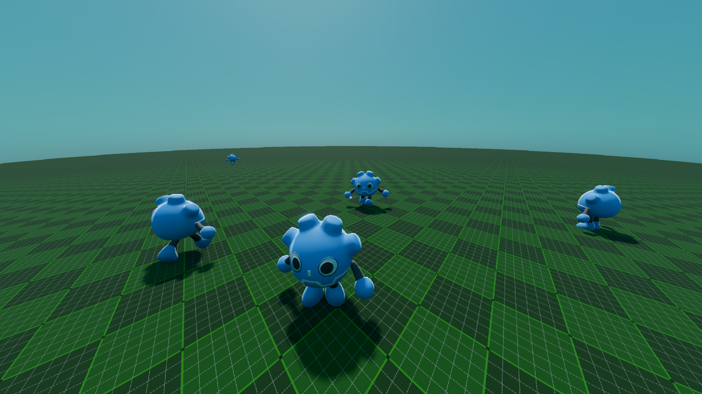

# Compositor Effect Playground
A Godot project for playing around with compositor effects.

<b>Benchmarks</b>

These benchmarks are rough estimates pulled from the Visual Debugger.

| Effect | Time |
|-|-|
| Stencil | ~0.03ms |
| Extraction | ~0.06ms |
| Jump Flood | ~0.5ms |
| Outline | ~0.02ms |
| Panini Projection | ~0.12ms |

## Stencil Buffer Texture

Currently, Godot does not expose the stencil buffer to be sampled.

* `StencilEffect` works around this with 8 render passes - one per bit.
* Each pass sets `compare_mask = reference = (1 << i)` with `COMPARE_OP_EQUAL`, isolating that bit as the pass condition.
* Passing pixels write `(1 << i)` as a float into the output texture
* Additive blending (`ONE + ONE, BLEND_OP_ADD`) accumulates all 8 passes into the final `[0-255]` output.

#### References
| Link | Description |
|-|-|
| [Stencil Buffer Texture](https://github.com/dmlary/godot-demo-sencil-buffer-compositor-effect) | Originally based on this. | 
| [CodePage12](https://github.com/otaviogood/shader_fontgen/blob/master/codepage12.png) | Font texture used for debug shader. |

## Outlines

*Stencil → Extraction → Jump Flood → Outline*

#### References
| Link | Description |
|-|-|
| [Outline Shader - Roystan](https://roystan.net/articles/outline-shader/) | One of the articles that inspired me to implement this after reading years ago. |
| [Distance Field Outlines - Pink Arcana](https://github.com/pink-arcana/godot-distance-field-outlines) | First saw it when it came out in 2024. Great learning material. |
| [Getting started with CompositorEffects and Compute shaders - Pink Arcana](https://github.com/pink-arcana/godot-distance-field-outlines/discussions/1) | Discussion on the above. |

## Panini Projection
| Before | After |
|-|-|
|  |  |
> FOV = 130° 
> FSR 2.0 → Scaling = 2.0

## Project References

| Link |
|-|
| [Scene Data Include](https://github.com/godotengine/godot/blob/master/servers/rendering/renderer_rd/shaders/scene_data_inc.glsl) |
| [Include Scene Data Virtually](https://github.com/godotengine/godot/blob/98782b6c8c9cabe0fb7c80bc62640735ecb076d3/servers/rendering/renderer_rd/renderer_scene_render_rd.cpp#L1679C6-L1679C7) |
| [Compute Shader Textures](https://nekotoarts.github.io/blog/Compute-Shader-Textures) |